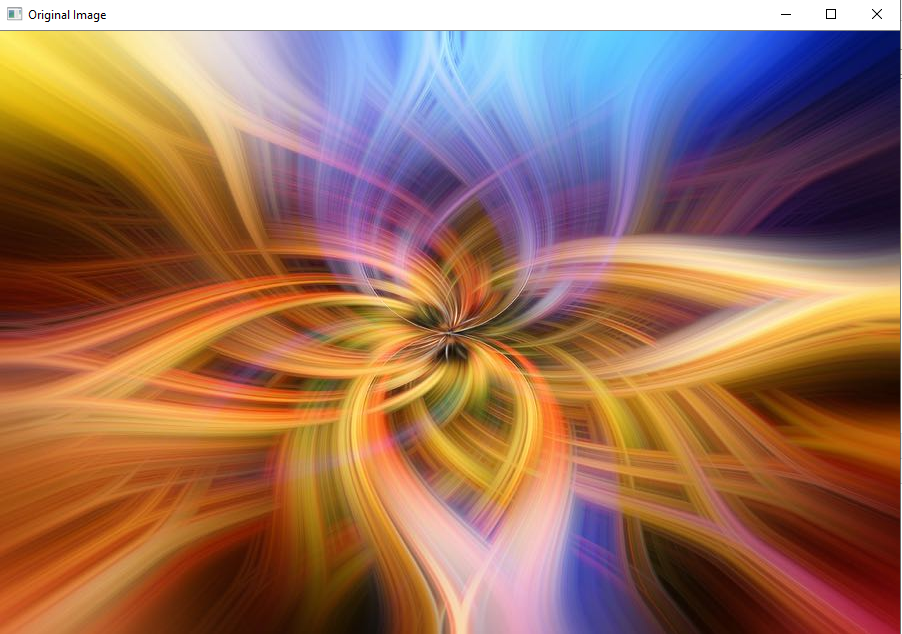

<div align="center">

 
 


</div>


Este é o primeiro trabalho da disciplina de Processamento Digital de Imagem. O objetivo é aplicar uma série de filtros em imagens digitais e observar os resultados. 

O **ImageFilter** é um sistema desenvolvido para manipulação e aplicação de filtros em imagens RGB. Este projeto foi criado para facilitar o processamento de imagens digitais, permitindo a aplicação de diversos filtros que melhoram a qualidade visual e a análise das imagens.

## Como Funciona

O sistema utiliza o modelo de cores RGB, que é um sistema aditivo baseado nas cores primárias: vermelho, verde e azul. A partir deste modelo, o **ImageFilter** aplica uma série de operações e filtros, incluindo:



1. **Conversão Entre Sistemas de Cores**: Permite a adaptação de imagens para diferentes dispositivos.

2. **Isolamento de Bandas**: Separa as bandas de cor para análise individual, útil em aplicações como exames médicos ou imagens de satélite.


3. **Limiarização**: Transforma imagens em níveis de cinza em imagens binárias, facilitando a detecção de bordas e formas.

4. **Filtros de Brilho**: Inclui brilho aditivo e multiplicativo, ajustando a intensidade das cores para melhorar a visibilidade.


5. **Filtros Correlacionais e Convolucionais**: Utilizados para suavizar imagens, remover ruídos e acentuar bordas, aplicando máscaras sobre os pixels.

## Como Usar

### CLI

1. Clone o repositório
```bash
git clone https://github.com/FelipeNasci/ImageFilter.git
cd ImageFilter
```
2. Instale as dependências
```bash
pip install opencv-python
```
3. Execute o arquivo `Use.py`
```bash
python Use.py
```

### Docker

1. Clone o repositório

```bash
git clone https://github.com/FelipeNasci/ImageFilter.git
cd ImageFilter
```
2. Crie o container
```bash
docker container run -it -v=$(pwd):/app python bash
```

3. Atualize o SO e instale as libs necessárias
```bash
apt-get update && apt-get install -y libgl1-mesa-glx libxkbcommon-x11-0 libxcb-xinerama0 xvfb
```

4. Execute o projeto
```bash
cd /app
xvfb-run -a python Use.py
```
